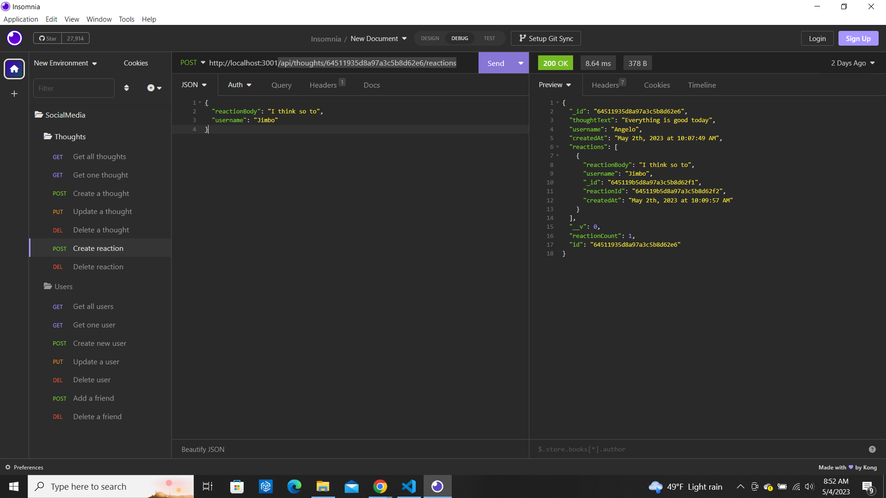

# Social Media Backend

## Description
Allows for testing of the  backend of social media site using Insomnia.  You can create, view, edit and delete users. You can add friends to users as well.  You can also create, view, edit, and delete user thoughts.  User thoughts can have reactions

## Table of Contents
- [Social Media Backend](#social-media-backend)
  - [Description](#description)
  - [Table of Contents](#table-of-contents)
  - [Installation](#installation)
  - [Usage](#usage)
  - [Licence](#licence)
  - [Contributing](#contributing)
  - [Tests](#tests)
  - [Questions](#questions)
  - [Screenshot](#screenshot)
  - [Link to Github repository](#link-to-github-repository)
  - [Link to walkthrough video](#link-to-walkthrough-video)

## Installation
Clone the github repository. Install express and mongoose by typing npm install in terminal. Type npm start to start the application
and open up Insomnia to test the routes.
## Usage
Once in Insomnia, to create user use a post route /api/users. You must include username and email. To view users use a get route api/users/. To view one user use get route /api/users/userid. To edit users use a put route /api/users/userid. And delete a user by using a delete route /api/users/userid. To add friends to users use a post route /api/users/userid/friends/friendid. To delete a friend use delete route /api/users/userid/friends/friendid. 
To create a thought use a post route /api/thoughts. You must include thoughtText, username, and userid. To view users use get route /api/thoughts.  To view one thought use get route /api/thoughts/thoughtid. To update a thoght use put route /api/thoughts/thoughtid. To delete a thought use delete route /api/thoughts/thoughtid.  To create a thought use post route /api/thoughts/thoughtid/reactions. You must include reactionBody and username. To delete a reaction use delete route /api/thoughts/64511935d8a97a3c5b8d62e6/reactions/reactionid. When you delete a user the users thoughts are also deleted.
## Licence
This project uses the [MIT](https://opensource.org/license/mit/) license.

## Contributing
If you would like to contribute to this project email me at the address below.
## Tests
None at this time.
## Questions
If you have any questions you can contact me at [michaeloc@verizon.net](michaeloc@verizon.net)  
Visit me at [Github](https://github.com/michaeloc1)
## Screenshot

## Link to Github repository
[Link](https://github.com/michaeloc1/SocialMediaBackEnd) to Github repository.
## Link to walkthrough video
[Link](https://www.youtube.com/watch?v=Q2imsME2SkU) to walkthrough video.
